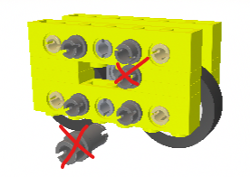

## Opening a model in a browser

As a cloud-centric system, Solidworks for Makers allows one to view - and even edit - the models saved to the "3DExperience" (i.e. cloud), via a few options.

### 3DPlay

<!-- tbd. describe what 3DPlay is -->

### 3DNavigate

<!-- tbd. describe what 3DPlay is -->

### xDesign

<!-- tbd. describe what xDesign is -->

>Note: Rendering is not necessarily 100% as you see it in Solidworks for Makers. Check before you share material this way that is qualifies your needs.
>
>For example, here's a small model with some extranous part instances showing online:
>
>
