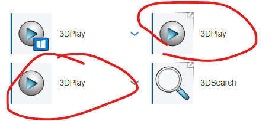

# 3DStuff

>Warning. This author has an enduring, but negative attitude to *anything* "3DExperience". It's not an opinion. It's based on struggling and pain, which remaining Dassault personnel seem to have developed an immunity against.

Thus, "stuff" having to do with 3DExperience is kind of *quarantined* in this folder, as to not contaminate the entire repo with the bitterness.

You may well wish to skip this folder.

---

Still here?

- [Open material in 3DSpace](./Open%20material%20in%203DSpace.md)

   A story of how the author found things **can** be done in the 3DExperience UI. After 6 months of thinking, they cannot.

   `#UX` `#discoverability`

- Three `3DPlay` icons.

   Just. Don't tell me why. I'm sure there's a perfectly "valid" reason presented in the conference room for this!

   

