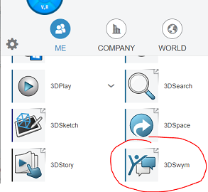
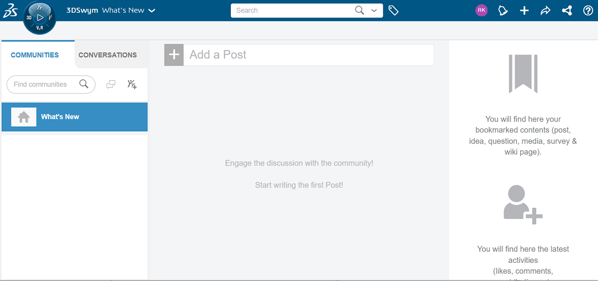
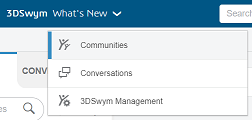
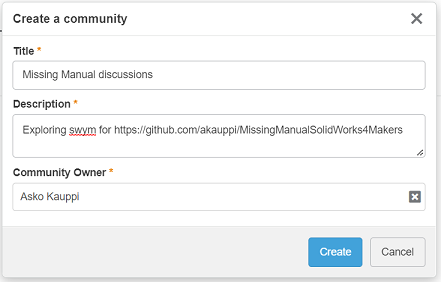
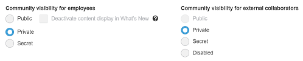
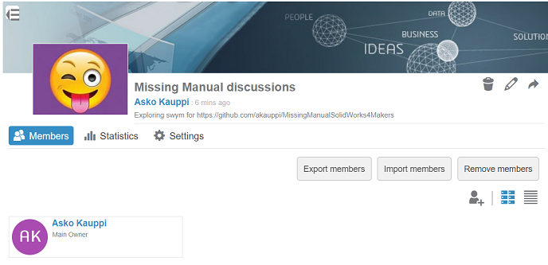
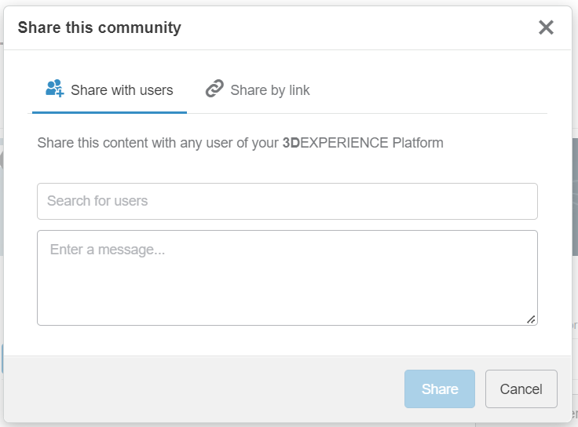
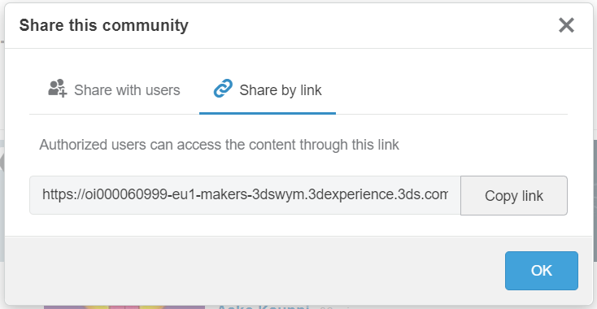

# Collaboration

This page describes:

- enabling collaboration on your (cloud based) project
- inviting members

## Requirements

We expect you to have a Solidworks for Makers assembly, which is saved to 3DExperience (i.e. online).

## Dassault approach

Solidworks for Makers has no tools for collaboration. One cannot even get a URL (that one could share with friends, as an invite) to an online project. There is no "Invite" or "Collaborate" menu item, anywhere. `File` > `Publish...` opens a file save dialog.

This is so pre-cloud days. On purpose.

The cloud is touched from the `3DExperience Launcher` - the same you use for launching SolidWorks.

>Swym is for "See what you mean". The author remembers that by adding an "I" as in "I see what you mean.." ;)

Go to `3DSwym Management`:

Let's create a community. Press `+ Community`.

What are these?

>Dassault: This is where tooltips would help. Now, the user cannot really know what the consequences of the various options are.

**Community visibility for employees**

|||
|---|---|
|Public|
|Private|
|Secret|

**Community visibility for external collaborators**

|||
|---|---|
|Public|
|Private|
|Secret|
|Disabled|

>In `[1]`, the person picks `Private`, `Private`. 
>
>I selected `Private`, `Secret` but don't exactly know what the "secret" means *(chime in if you do!)*.

---

Press `Apply` and click on the community tab to the left.

<!-- Disabled; this is for people already in your organization
You can now start inviting people.

>Now, be careful!!!
>
>The next step is **not** `Import members` or (person + icon). Instead, focus on the little arrow: 
-->

Focus on the top right corner:

>

This leads to the Right Stuff.

>Note: Only happened to notice this way, slow-replaying the [1] video.

**Share with users**

"Share this content with any user of your 3DEXPERIENCE Platform"

Me: types "Elvis"

>No results

Me: types "Peter"

>No results

Me: types "Asko"

Found.

So... **engaging analysis mode**

When Dassault writes "your 3DEXPERIENCE Platform", what they mean is "your 3DExperience organization" (or instance, or ...). This is understandable in a traditional company setup, where one would collaborate with other employees, and maybe customers and subcontractors as well. Not the world.

The model does not bode well to makers. We want to collaborate potentially with anyone.

So, let's see the other tab: "share by link"

**Share by link**

That link leads to a 3DExperience login page. 

Pass this invite on in any media you like (twitter, email, ...). 
>Remember that the link only makes sense to other users of Solidworks for Makers. People with a "normal" Solidworks license won't be able to open the designs.*

Once someone uses the link, they will:

- need to authenticate with their 3DExperience ID. 

- ...*tbd. describe the experience, from there side*

*tbd. What do I see, when someone's used the link?*

*tbd. How to actually share the design??*

## Feelings...

The author is not sold on the 3DSwym approach.

It might be a suitable solution for enterprise companies, doing a lot of CAD. For hobbyists, the interface is awkward, and Yet Another Tool to know.

Makers are often versed in collaboration tools. We judge these against Discord, and these tools *cannot* live to that standard.

A slimmed down approach, leaving out discussion forums (because we already have them) but focusing on access rights management, would entice the author.

## References

- [3DExperience Tutorial - 3DSwym](https://www.youtube.com/watch?v=bBzx4eoeUiA) (Youtube 2:35, undated) [1]

   Shows a guy showing 3DSwym. Slow motion helps understand some aspects.
   
- ["Collaborating Remotely Using SOLIDWORKS: How to Do It Like the Pros"](https://blogs.solidworks.com/solidworksblog/2020/05/collaborating-remotely-using-solidworks-how-to-do-it-like-the-pros.html) (blog+video, May 2020)
