# Collaboration

This page describes:

- enabling collaboration on your (cloud based) project
- inviting members

## Sources

Dassault advices to follow:

- ["Cross-Company Collaboration or how to invite a user on your platform without consuming your license keys?"](https://r1132100503382-eu1-3dswym.3dexperience.3ds.com/#community:4/post:rHFgrLlQRr6w7xEwrVCYlA) (wiki, updated Feb 2019; requires authentication by 3DExperience ID)

   >Note: Starting some time between Sep 2022 and Feb 2023, the `Configure Members Options` is no longer visible in a Maker customer's `Members Control System`. This might be a good change, but it also means Dassault should stop referencing that document, since its steps cannot be replicated. /AK

The author also found:

- ["3DEXPERIENCE Platform Administration: Adding users from outside your organization"](https://www.cati.com/blog/3dexperience-platform-administration-adding-users-from-outside-your-organization/) (blog, Mar 2021)

   This is a more readable version, and more current.

>Note: The process does apply to Solidworks for Makers as well, though the wiki page outdates its release by whole 2 years.

+ Discussed here (Feb 2023):

- ["Sharing Access to a Collaborative Space"](https://r1132100503382-eu1-3dswym.3dexperience.3ds.com/#community:kKnaKWHGTPC4ut-q1X_9uA/iquestion:8uyanJu_Q3u764mmSTXirw) (Makers \| Support forum)

## Requirements

We expect you to have a Solidworks for Makers assembly, which is saved to 3DExperience (i.e. online).

- A friend maker (with Solidworks for Makers account) who's playing along
   - email address to such person; the one associated with their 3DExperience ID.
   - they should already have started using the account, i.e. done initial log-ins with an 3DExperience ID.

With these information you should be able to send an invite, and end up collaborating in the same Solidworks for Makers project.

Let's start!

<!-- disabled
## Dassault approach

Solidworks for Makers has no tools for collaboration. One cannot get a URL that one could share with friends, as an invite, to an online project. There is no "Invite" or "Collaborate" menu item, anywhere. `File` > `Publish...` looks inviting, but opens a file save dialog, instead.

This is so pre-cloud days.

This (cloud collaboration) could be handled in the 3DExperience side of things (for Solidworks for Makers projects). Unfortunately, the current (Sep 2022) model is **not built for makers** but for larger companies, instead.
-->

## Steps

### 0. Preparations (one time)

- 3DExperience Launcher > `Members Control Center` (it's an app, in the left panel..)
   
   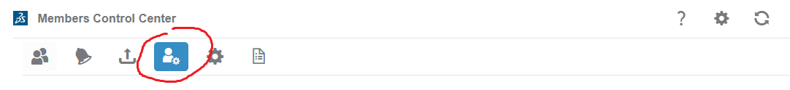

   - Enable these:
   
      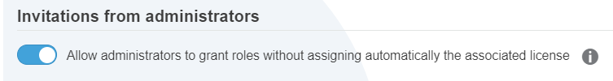

      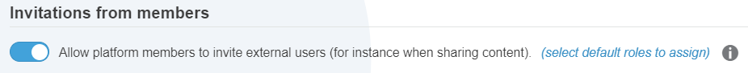

   - Click `(select default roles to assign)` <!-- this step is not mentions in the Dassault wiki page -->

      - `View all` > check `3DEXPERIENCE SOLIDWORKS Professional`
      - clear the `Assign License` checks

         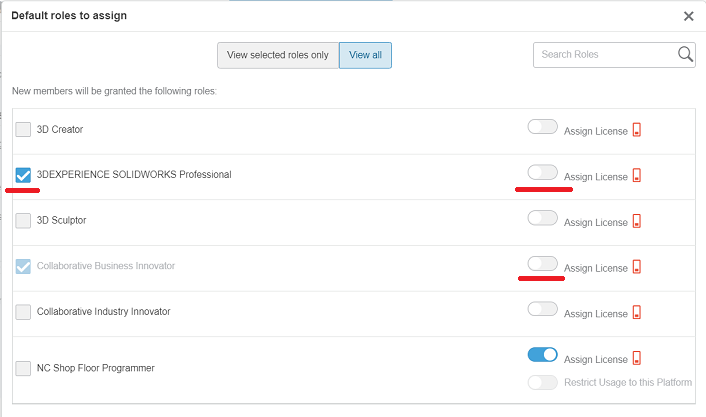
      
         Return to the `View selected roles only` page; it should now look like:
      
         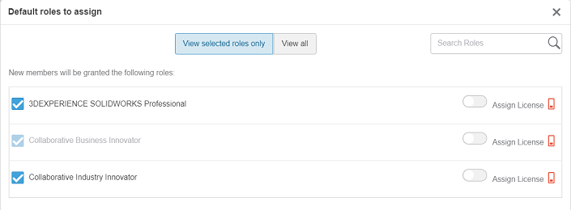

      - `Save`

### 1. Sending the invite

Close any "apps" open in the 3DExperience window (top right `x`). You should see a `Members` tab; click it.

   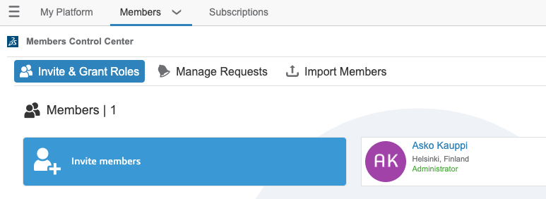

- `👤+ Invite members`

   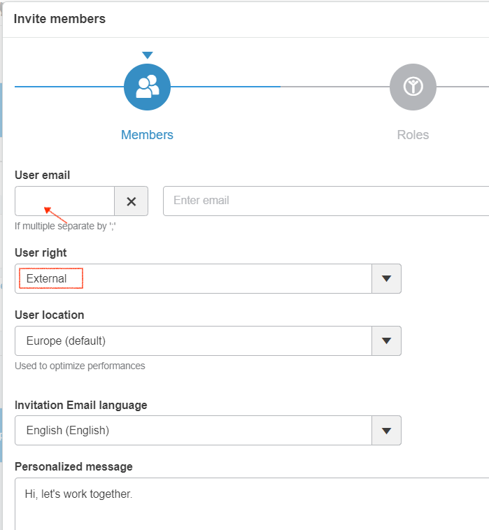

   - `User email`: fill the email of the invitee that is connected to their 3DExperience ID (or they'll register as such)
   
   - `User right`: `External`
   
      >This is explained in a third party [blog post](https://www.cati.com/blog/3dexperience-platform-administration-adding-users-from-outside-your-organization/) (Mar 2021), which says:
      >
      >>If the users are a part of your company and will be using your Roles you will select **Member** under User rights. If the users are bringing their own Roles to the Tenant, you will select **External**.

- Proceed to `Roles`

   >We can stick with the `Available roles with licenses` section.
   
   Check `3DEXPERIENCE SOLIDWORKS Professional`.
   
   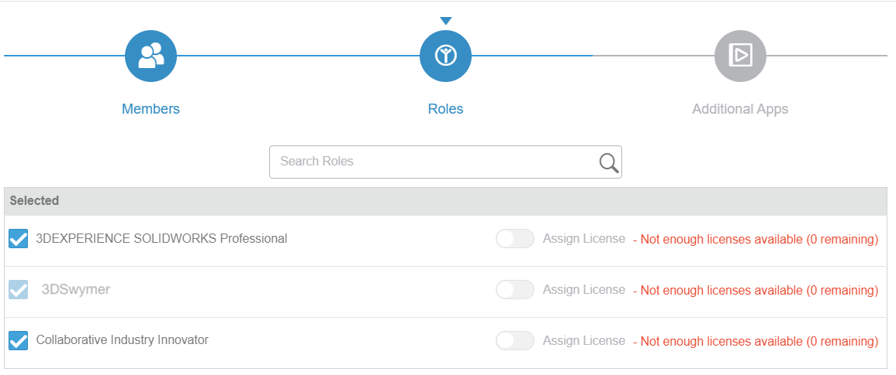
   
   >Note: Ignore the red "not enough licenses". It seems like a UX glitch.
   
   - `Next` 
   - `Invite`
   
**What you see**

- 

**What the invitee receives**

- They get an email:

   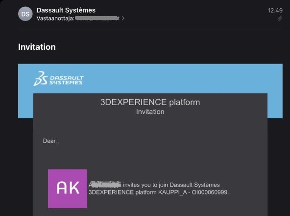

   The email is sent from `noreply@3dexperience.3ds.com` and "Dassault Systèmes". The title doesn't mention you at all, which is a bit.. disappointing.

>Note: The author is not aware of an invite link (a URL) that could be passed to the recipient via *any* communication channels. This would be a nice feature, since when one invites another maker, there's likely some communication going on, already.
> 
> Likewise, there is no support for "allow any other Solidworks for Maker customer to join". Unfortunate. It would be nice, if the engagement can be started also from the collaborator's side.
   
Pressing the link leads to 3DExperience login page, or registration if the person is new to 3DExperience.

### 2. Preparations (one time; receiver side)

The receiver of the invite **also** needs to prepare their 3DExperience settings, to allow *their* license to be used in the collaboration:

- Visit `Members Control Center` > `Members` > `Configure Members Options` icon with a person and a gear

   - Enable `Invitations from administrators` 
   
      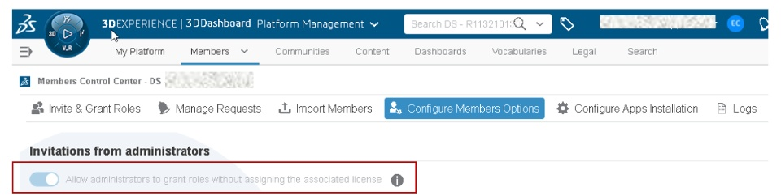

>Note: We could check whether this step really is necessary. Dassault instructions from 2019 (and an online comment from 2023) say it is.

- On one's own user id, click the `(i)` (info) icon.

   This shows up:

   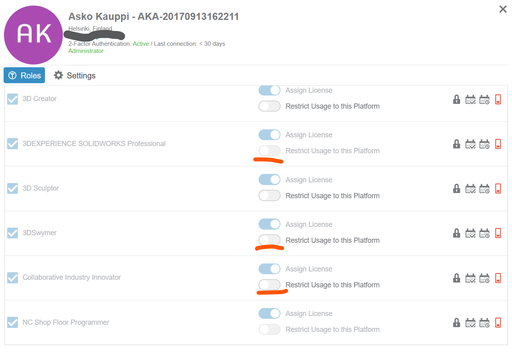

   >Notice `3DEXPERIENCE SOLIDWORKS Professional` having `Restrict Usage to this Platform` off.

   **Likely**, you will need to lift the restrictions on `3DSwymer` and `Collaborative Industry Innovator` roles, too.

  
## Sharing Collaboration Spaces

The realm of granting access to your data is per collaboration space.

In order to share data with someone, you must have first invited them, as described above. The invite itself doesn't grant them any access, but you can proceed to granting such access already while the invite is in `pending` state.

Access is handled in the `3DSpace` "application".

### Grant rights in `3DSpace`

Go to your `3DSpace` "application", online.

- Choose a collaboration space to share.

   - From the `v` dropdown, `👤+ Add members`

      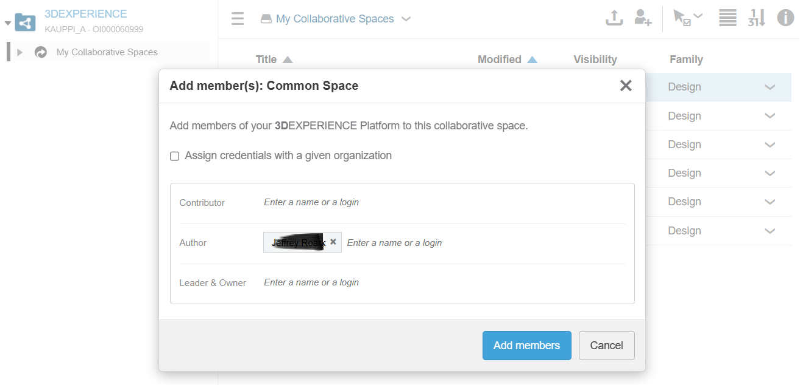

      |role|means|
      |---|---|
      |`Contributor`|Read-only access|
      |`Author`|Edit access|
      |`Leader & Owner`|(likely you don't want to share these)|

      <!-- tbd. The author has no idea what `Assign credentials with a given organization` means. #help
      -->

      >Note that `Contributor` doesn't mean what it says. A person with this role won't be able to contribute.

## Questions

### Where do I see whom I've shared stuff with?

One way seems to be `3DSpace` > `(i)` tab:

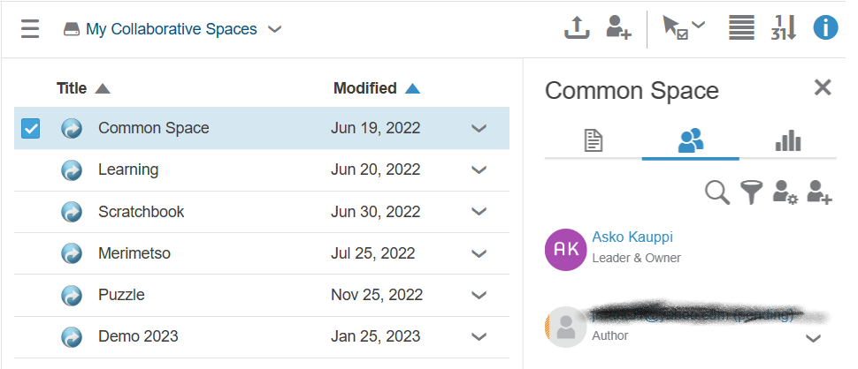

You can now juggle through the spaces, and list of people who have access updates on the right.

>Good enough. If you know of a better method, suggest one. :)

## References

- [3DExperience Tutorial - 3DSwym](https://www.youtube.com/watch?v=bBzx4eoeUiA) (Youtube 2:35, undated) [1]

   Shows a guy showing 3DSwym. Slow motion helps understand some aspects.
   
- ["Collaborating Remotely Using SOLIDWORKS: How to Do It Like the Pros"](https://blogs.solidworks.com/solidworksblog/2020/05/collaborating-remotely-using-solidworks-how-to-do-it-like-the-pros.html) (blog+video, May 2020)
