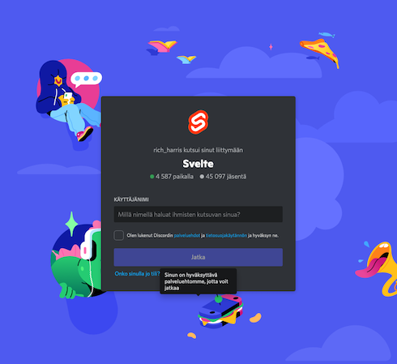
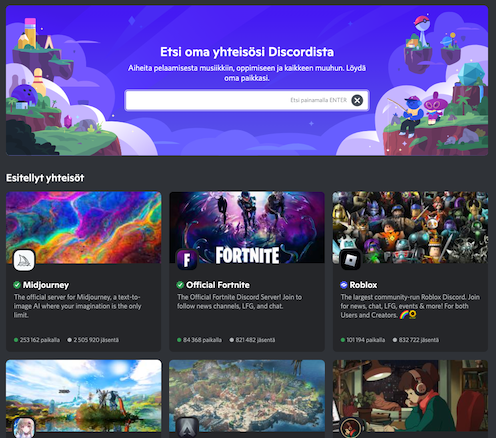
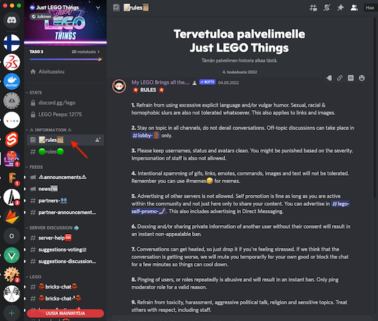
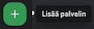
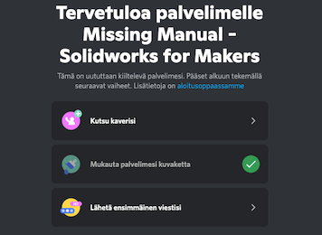

# Discord

[Discord](https://discord.com) is a collaboration platform much appreciated by games, makers and such crowds.

The author prefers to mix-and-match tools, which allows better usability and less vendor lock-in. Discord is clearly his favourite collaboration platform in 2022.

>**Terminology**
>
>Discord calls each individual domain a "server", and this naming is maintained on this page. It doesn't mean those are actual, physical servers, and you definitely don't need one. Discord is available as a cloud service.

## Plunge in!

Before setting up your own service, it's good to get the hang of it, by joining some existing, vibrant communities. Here are some:

- ### Svelte

   Svelte is a popular web app framework, and has an official Discord channel.
   
   The invite link to their channel can be found on their [FAQ page](https://svelte.dev/faq):

      >...great place for discussion about best practices, application architecture or just to get to know fellow Svelte users. [Our Discord](https://svelte.dev/chat) or the Reddit channel are examples of that. 

	Clicking the link forwards to [`https://discord.com/invite/yy75DKs`](https://discord.com/invite/yy75DKs).

	Such links are **Discord invites**. For small to medium size channels, you'll need an invite to get in. Some channels may keep this a secret, others, like Svelte here, provide it publicly for anyone interested.
	
	Click the link.

   

	Enter your nickname. You can use the same across Discord servers (unless they are taken), or vary your nick.
	
   Once inside, do check the **pinned messages**. They usually provide instructions on expected behavior and rules that apply on the server.
	
  
- ### Just LEGO Things

   Unlike the Svelte server, this one is `public`. It means it's available in the Discord app's `Browse public servers` listing:
   
   
   
   Only big communities get here.
   
   Join the community. Just for a test - it's always easy to get out, as well..
   
   

   As the first thing you should do, see if there's a `rules` (or similar) page. **READ IT CAREFULLY** You are expected to follow these, or spend your time elsewhere.   
   

## Create your own server

Once you feel ready for it, you can create your own server. This can be done as an ad-hoc for e.g. a few weeks of project with friends, or as a more permanent, focused, collaborative space for your Maker projects.

As you have noticed by now, Discord servers have channels within them, and users can easily listen to - or hide - channels based on their liking. Having a good focus for your server, and a reasonably good selection of channels are keys.

However, the most important part is to get some people to join it, and like it!

### Steps

Push the `+` button. 

- `Create new` ... and otherwise follow their lead.

   This should only take 1-2 minutes.

>Note: You are asked to enable "boosts". You don't need to. They have something to do with improving your server, think of them as paid perks. Don't worry about it.

That's it. But it's lonely!

You can join the author's `Missing Manual - Solidworks for Makers` channel, to make it less so. :) The invite link is [`https://discord.gg/9sKdZFaa`](https://discord.gg/9sKdZFaa)

## Living sample

The idea is the above Discord channel would act as a place to show these and discuss about them. See you there!

