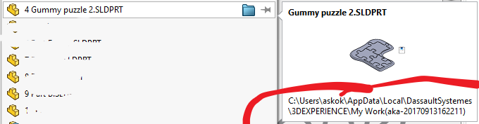

## Visual diff between revisions!!!

3DExperience provides us with a cloud-based revisioning system intended to facilitate collaboration, right?

This cycle is not complete. Without being able to see *what has my coworker done* to a model, *before* pulling it in, my incentive to use versioning is greatly reduced. It becomes like pulling a rabbit out of a hat!

**Pretend there's a meme GIF here..**

## Situation right now (R2022 Hotfix 4.7)

There is a `Tools` > `Changes` feature. It seems to be able to show:

>

- Changes between drawings
- Changes between documents (= volume, changed surfaces?)
- Changes between features (even if resulting objects are the same)
- Changes between geometry
- Changes between BOMs

This looks reasonable.

### Using it

>

Notice there's no mention of 3DExperience anywhere. If we use the tool without a project open, the `Reference document` pull-down is empty.

Also notice that `Within SOLIDWORKS PDM vault` is dimmed. This would be the link to a professional versioning interface. 

Maybe the team behind this tool just didn't "get the memo" about 3DExperience. Yet?

### Using with an open project

It's not much better if we open a 3DExperience project, unfortunately. 

We can do a comparison between different local files, but what's the fun in that!! 

The `Gummy puzzle 2` is a cloud-saved (3DExperience) project with multiple revisions. I want to compare *those* with each other.

If I proceed selecting the same project twice (in the hope of being asked about revisions), this faces me:

## Workaround

Since 3DExperience documents get cached locally, there's likely some way around the current lack of cloud-awareness..

### Brute Force approach

- Load a revision from 3DExperience (let's say B.1)
   - `File` > `Save as New ...` > `Save to This PC` 
   - Append the revision (`B.1`) to the filename; save to some temporary folder

- Repeat for another revision

>Note: Not sure whether this leads anywhere... Wasn't able to see a diff, but this workflow is *not* what I expect from a cloud-native tool (kind of) anyhow.
>
>So, wishing Dassault would bring an actual, visual diff, in 2024. Or. Some. Year...

<!-- whisper

The local caches are available in `C:\Users\{userid}\AppData\DassaultSystemes\3DEXPERIENCE\My Work({...})`. You can load the latest checked out revision from there (but not compare multiple revisions of the same model, which is the point...)

-->

## Wish to Dassault... (UX)

For the Solidworks Connected, the right place to bring diffing *cloud projects* seems the 3DExperience side panel already there.

Add here a `Compare to Revision` entry, and we're already more than half-way there.

Complement it with a `Peek from Server` that would show changes if I were to pull (Git terminology!) new changes to my local machine. That would be it!

## References

- [Running the Compare Utility](https://help.solidworks.com/2023/english/swconnected/swutilities/t_running_the_compare_utility.htm) (SW Connected docs) `[1]`

