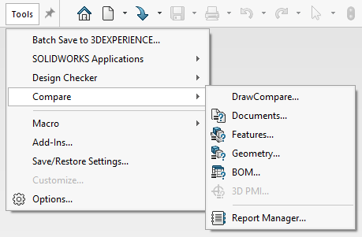
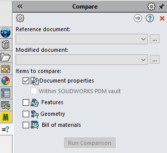
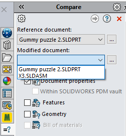
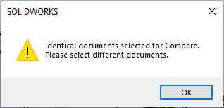
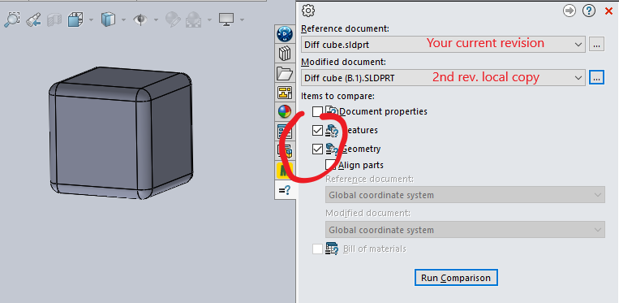
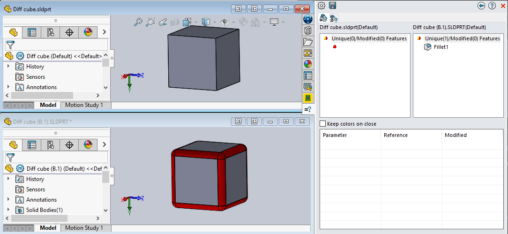
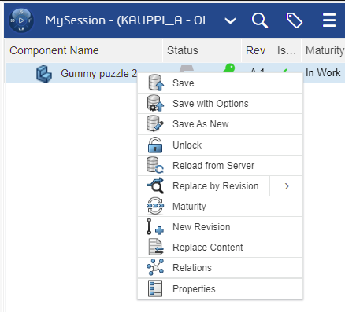

## Visual diff between revisions!!!

3DExperience provides us with a cloud-based revisioning system intended to facilitate collaboration, right?

This cycle is not complete. Without being able to see *what has my coworker done* to a model, *before* pulling it in, my incentive to use versioning is greatly reduced. It becomes like pulling a rabbit out of a hat!

**Pretend there's a meme GIF here..**

## Situation right now (R2022 Hotfix 4.7)

There is a `Tools` > `Changes` feature. It seems to be able to show:

>

- Changes between drawings
- Changes between documents (= volume, changed surfaces?)
- Changes between features (even if resulting objects are the same)
- Changes between geometry
- Changes between BOMs

This looks reasonable.

### Using it

>

Notice there's no mention of 3DExperience anywhere. If we use the tool without a project open, the `Reference document` pull-down is empty.

Also notice that `Within SOLIDWORKS PDM vault` is dimmed. This would be the link to a professional versioning interface. 

Maybe the team behind this tool just didn't "get the memo" about 3DExperience. Yet?

### Using with an open project

It's not much better if we open a 3DExperience project, unfortunately. 

We can do a comparison between different local files, but what's the fun in that!! 

The `Gummy puzzle 2` is a cloud-saved (3DExperience) project with multiple revisions. I want to compare *those* with each other.

If I proceed selecting the same project twice (in the hope of being asked about revisions), this faces me:

## Workaround

**Situation**

We have a revision `A.1` that we know of, and want to see what's changed to `B.1`.

To do this, we create a *local* copy of the `B.1` because the existing SolidWorks Maker can show diffs between projects. In other words, we extract the revision(s) to compare to into local copies.

**Steps**

- Using the 3DExperience side panel, change to the revision (`B.1`) you wish to compare with
- `File` > `Save as New ...` > `Save to This PC` 
   - click `Save as copy and continue`
   - append the revision (`B.1`) to the filename; save to some temporary folder
- Change back to your reference revision.
- `Tools` > `Compare` > `{Document|Features|Geometry}` any will do
   - pick the project name for `Reference document`
   - pick the local copy for `Modified document`
   - check `Features` and `Geometry` - or what you fancy

      

   - press `Run Comparison`

You can see in red that the modified revision has removed material at the edges.

To the right, you see the features removed/added between the revisions.

To see geometry changes, click the small tab.

>This is obviously just a naive small sample, but it does show the workflow how one can, with R2022x Solidworks Maker see visual and feature-wise differences between two revisions of the same project.

## Wish to Dassault... (UX)

For the Solidworks Connected, the right place to bring diffing *cloud projects* seems the 3DExperience side panel already there.

Add here a `Compare to Revision` entry, and we're already more than half-way there.

Complement it with a `Peek from Server` that would show changes if I were to pull (Git terminology!) new changes to my local machine. That would be it!

## References

- [Running the Compare Utility](https://help.solidworks.com/2023/english/swconnected/swutilities/t_running_the_compare_utility.htm) (SW Connected docs) `[1]`

<!-- #whisper

Person called @Joy Garon works for Dassault - and could know about this. see -> https://r1132100503382-eu1-3dswym.3dexperience.3ds.com/#community:kKnaKWHGTPC4ut-q1X_9uA/iquestion:RGtPxdgcSRyR5qeyRusSuQ/answer:swym%3Aprd%3AR1132100503382%3Aqnaanswer%3AMFvfi68gS3mt0R0EpRU3_g/comment:swym%3Aprd%3AR1132100503382%3Aqnaanswer%3AMFvfi68gS3mt0R0EpRU3_g%3Acomment%3AuX6-z5E2R2yljN8n5ppgeQ
-->