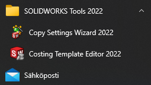

# Questions to SolidWorks

## `SOLIDWORKS Maker` - what is it?

Documentation [here](https://help.solidworks.com/2022/english/SWConnected/swdotworks/r_publish_homebymePM.htm) mentions "SOLIDWORKS Maker". 

Does this mean "SolidWorks for Makers", or something else? A brand should always be written in just one way!

>Looks like some ancient reference to what then became Solidworks for Makers.

## Is Solidworks Performance Test intended to be part of Solidworks for Makers (it's not)

Mentioned in [Benchmarking your hardware](https://help.solidworks.com/2022/english/SWConnected/swdotworks/t_benchmarking_hardware.htm) (SW Connected docs).

It's not there on my install (2022, Hotfix 4.7).

>

### More confusion...

[This page](https://help.solidworks.com/2022/english/SWConnected/swdotworks/c_SOLIDWORKS_Rx.htm) (same documentation) mentions:

>To run the SOLIDWORKS performance benchmark, on the Benchmark tab of the SOLIDWORKS Rx dialog box, click Start Benchmark.

There's no SOLIDWORKS Rx, either.

