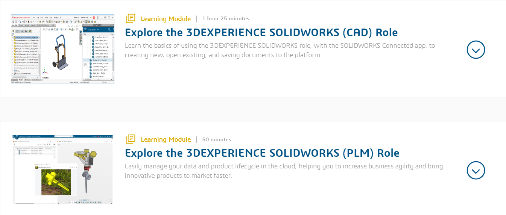
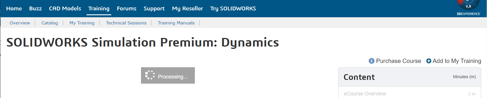

# Solidworks for Makers - Missing manual

<!-- tbd. make a model of a manual book (in SolidWorks), picture here :)
-->

In 2021, Solidworks for Makers was introduced. Instead of multiple thousands of Euros[1] per year, the CAD product is now finally in the reach of hobbyists, at a mere ~120 Eur / year.

This is the **FIRST PROFESSIONAL GRADE CAD PRODUCT** available for hobbyists.

Unfortunately, Solidworks' documentation and support are somewhat flaky, and the author has not found documentation about the *Solidworks for Makers* product offering, on its own. This is where the repo steps in. It's a collection of the things you should know.

Hope it helps you. Let's hop in!

<small style="background-color: lightaqua">`[1]`: Pricing varies somewhere around 2000..4000 eur. SolidWorks doesn't really offer a price list. Normally, its licenses are bought via distributors (whereas the Solidworks for Makers comes directly). The [How to Buy](https://www.solidworks.com/how-to-buy) page offers the categories, but no prices.</small>

>The "Missing manual" is a reference to [this series](https://www.amazon.com/b?ie=UTF8&node=8523805011) (Amazon.com) of books. They were popular in the early 2000's, when people bought Apple products bundled with awesome software but no real guidance on how to use them.

## Focus

The focus of this repo is in the *use* of Solidworks for Makers.

We don't look at the "xDesign" and "xShape" browser-based offerings. They are available to Solidworks for Makers customers, and that's all great. But they are seen as alternative toolchains.

With Solidworks for Makers, you can store projects either locally or in the cloud. This repo focuses solely on cloud based storage because a) it's deemed safer (by the author), b) it may not be immediately obvious (needs a manual), and c) it provides a platform for team based work (of course we want other people to do our work, right!).

## Buying the license; installing the software

There's some desperate writes online by people not able to get the software running, in early 2022. This is unfortunate, but we overlook it. It's the responsibility of Dassault to make the experience better. (The author was able to install, in Aug 2022)

### What you get

- Solidworks Professional

   It's able to work on local files, or files in the cloud.

- 3DExperience ID

   This is how you log into Solidworks documentation, support forums etc.
   
   >Note: What you have is a "3DExperience ID". It is not a "Solidworks ID".

#### Restrictions

Files you work on can *only be opened by other Solidworks for Makers* instances, not the "other" Solidworks licenses.

### Hardware and OS requirements

Makers often run on more aged hardware than professional CAD people, so it's good to know what actually works.

||Solidworks recommends|What works|
|---|---|---|
|CPU|"64-bit; Intel or AMD"|Lenovo X230 (2012)|
|RAM|16 GB|12 GB but would definitely recommend 16 GB|
|Graphics|"Certified cards and drivers"|your integrated Intel-based likely works|
|Windows|10 or 11, 64-bit|Windows 10 Home|
|SSD|"recommended"|yes! you want to have SSD|

[source](https://www.solidworks.com/support/system-requirements)

## Learning resources

The Internet has loads of Solidworks courses, but nothing much that focuses on SolidWorks for Makers, yet. This list is intended to help.

### Learning path

With your "3DExperience ID", you should be able to log into a 3DExperience Dashboard:

This is where learning material for Solidworks for Makers should be.

At the time of writing, there are **only two** learning modules available.

>

>Note the `3DEXPERIENCE R2022x v` drop-down menu on the page. Change it to match your version before viewing.

---

We can do better than that!!!

Next, let's see Dassault's own "MySolidworks" video offerings.

### MySolidWorks videos

This is a training catalog with good contents, but unfortunately its usability sucks. Also, it's not even *supposed* to be available for Solidworks for Makers customers.

>Ideally, Dassault would add a "Makers" category and integrate the new commercial offering with this library. That's unlikely to actually happen, since what the company would like us to do is switch to using their 3D browser based tools.

It's not that bad.. The access rights to these videos seem to be badly managed - or not at all. By signing in to MySolidWorks as a "Guest" (anyone can?) you have access to more educational videos than what Dassault would otherwise offer you.

>To get to these without direct links:
>- SolidWorks for Makers > `Ctrl-F2` > `Learn` > `Get Started with SOLIDWORKS CAD` 
>  - ... > (login with `3DExperience ID`) > `Catalog`

The `3DEXPERIENCE (Edu)` link leads to the portal we already covered.

- Double click the `Learning Path` box
   - `Log in` > 

Press `Catalog` and you'll be greeted by all kinds of courses:

>Note. As of Aug 2022, the selection is *not aware of Solidworks for Makers* customers. You are allowed to see only the videos meant for "Guest"s.
>
>This is something Solidworks should work upon, providing a meaningful, and comprehensive, subset of the training videos that are available for a *Solidworks for Makers* customer. At the moment, if one picks a training course for "Standard" (which should be relevant for Solidworks for Makers, since it is SolidWorks Professional..), one gets a rather unpleasant dialog asking to "Upgrade". Please fix.

Pick `Guest`. This restricts your choice to 91 videos (as of Aug 2022).

---

Now, *somehow* I ended up in this **other** MySolidWorks > `Training` > `Catalog` page:

- https://my.solidworks.com/training/catalog

Here, we have **192 videos for Guests**. Plus we have a filter for `Professional`:

>Now, it can be this is just MySolidworks prepping up a revise in their video offering. Let's see if it's stable in a week or so.

---

>**Weird.** If you select `[x] Professional` and try to see one of those videos, it's not "Professional" (which is covered by Solidworks for Makers) but "Premium" (which is not).
>
>

---

Let's keep `Access Level` to `Guest` - because those are the courses MySolidWorks allows us to watch.

Also click:

- `Version: [x] 2022`, though this might leave some of the courses out

>The `Product / Role` filter only confuses the author:
>
>
>
>This looks like a **random** collection of products and roles, no consistency.
>
>Maybe these are intentionally "free" (access-wise) training courses throughout the Solidworks offering. But it means you hunting for knowledge for *Solidworks for Makers* is a hit-and-miss.

The author has gone through the 63 (or so) courses. Here are the reviews:

>**Usability hints**
>
>Controls are *way* too small. Click the thumbnail and then `Launch in a separate window` to have a decent experience.
>
>If you pause, the player skips to next section on its own. That's unprofessional.
>
>You cannot change the playback speed. Gosh.

To help you, below are direct links to the training material available in Aug 2022 (filtered by `Version:` `2022`).

- [Part modeling](https://my.solidworks.com/training/lessonviewer/22-ENG-ESS-0048/) (18 min)
- [Assembly modeling](https://my.solidworks.com/training/lessonviewer/22-ENG-ESS-0049/) (13 min)
- [Drawings](https://my.solidworks.com/training/lessonviewer/22-ENG-ESS-0050/) (20 min)
- [View manipulation](https://my.solidworks.com/training/lessonviewer/22-ENG-ESS-0055/) (13 min)
- [Solidworks basics and User Interface](https://my.solidworks.com/training/lessonviewer/22-ENG-ESS-0054/) (26 min)
- [Linear Static Structural Analysis of an Assembly](https://my.solidworks.com/training/lessonviewer/22-ENG-SSE-0006/) (17 min)
- [Assembly Analysis with Connections and Mesh Refinement](https://my.solidworks.com/training/lessonviewer/22-ENG-SIM-0009/) (19 min)
- [Analysis of Thin Components](https://my.solidworks.com/training/lessonviewer/22-ENG-SIM-0004/) (12 min)
- [Bolt connections](https://my.solidworks.com/training/lessonviewer/22-ENG-SIM-0003/) (16 min)
- [The Analysis Process](https://my.solidworks.com/training/lessonviewer/22-ENG-SIM-0002/) (14 min)
- [Introduction to Mold Design](https://my.solidworks.com/training/lessonviewer/22-ENG-MLD-0001/) (9 min)
- [Starting a Sketch on a Plane or Face](https://my.solidworks.com/training/lessonviewer/22-ENG-ESS-0033/) (9 min)
- [UI Customization](https://my.solidworks.com/training/lessonviewer/22-ENG-ESS-0019/) (11 min)
- [Hole Wizard](https://my.solidworks.com/training/lessonviewer/22-ENG-ESS-0015/) (8 min)
- [Planes](https://my.solidworks.com/training/lessonviewer/22-ENG-ESS-0014/) (9 min)
- [Path Configurations](https://my.solidworks.com/training/lessonviewer/22-ENG-ESS-0007/) (12 min)
- [Sketch: Smart dimension](https://my.solidworks.com/training/lessonviewer/22-ENG-ESS-0005/) (10 min)
- [Drawings and Detailing](https://my.solidworks.com/training/lessonviewer/22-ENG-ESS-0002/) (15 min)
- [Assembly Drawing Views](https://my.solidworks.com/training/lessonviewer/22-ENG-DWG-0001/) (13 min)
- [Certification Center and User Account](https://my.solidworks.com/training/lessonviewer/22-ENG-CSWX-0003/) (10 min)
- [Running and Postprocessing a Flow Simulation Project](https://my.solidworks.com/training/lessonviewer/22-ENG-FLOW-0004/) (18 min)
- [Preparing Flow Simulation](https://my.solidworks.com/training/lessonviewer/22-ENG-FLOW-0003/) (12 min)
- [Geometry Preparation in Flow Simulation](https://my.solidworks.com/training/lessonviewer/22-ENG-FLOW-0002/) (10 min)
- [Flow Simulation Overview](https://my.solidworks.com/training/lessonviewer/22-ENG-FLOW-0001/) (11 min)
- [SOLIDWORKS Treehouse - Navigating the User Interface](https://my.solidworks.com/training/lessonviewer/22-ENG-TREE-0001/) (12 min)
- [Getting started with SOLIDWORKS Certification](https://my.solidworks.com/training/lessonviewer/22-ENG-CSWX-0001/) (6 min)
- [Install PDM Standard](https://my.solidworks.com/training/lessonviewer/22-ENG-EPDM-0021/) (17 min)
- [PDM Standard Components](https://my.solidworks.com/training/lessonviewer/22-ENG-EPDM-0020/) (8 min)
- [Toolbar, Raytracing and General UI](https://my.solidworks.com/training/lessonviewer/22-ENG-VIS-0003/) (12 min)
- [The Load Case Manager](https://my.solidworks.com/training/lessonviewer/22-ENG-SIM-0010/) (14 min)
- [Frequency Analysis of an Assembly](https://my.solidworks.com/training/lessonviewer/22-ENG-SIM-0005/) (14 min)
- [The Simulation Suite of Products](https://my.solidworks.com/training/lessonviewer/22-ENG-SIM-0001/) (10 min)
- [Auto-routing](https://my.solidworks.com/training/lessonviewer/22-ENG-RPT-0005/) (7 min)
- [Enhanced 3D PDFs](https://my.solidworks.com/training/lessonviewer/22-ENG-MBD-0012/) (12 min)
- [Auto Dimension Scheme](https://my.solidworks.com/training/lessonviewer/22-ENG-MBD-0009/) (18 min)
- [Creating 3D PDF and eDrawing Files](https://my.solidworks.com/training/lessonviewer/22-ENG-MBD-0008/) (15 min)
- [3D Views](https://my.solidworks.com/training/lessonviewer/22-ENG-MBD-0006/) (21 min)
- [Additional 3D PMI Tools](https://my.solidworks.com/training/lessonviewer/22-ENG-MBD-0004/) (18 min)
- [Advanced DimXpert Tools](https://my.solidworks.com/training/lessonviewer/22-ENG-MBD-0003/) (20 min)
- [DimXpert Fundamentals (Overview)](https://my.solidworks.com/training/lessonviewer/22-ENG-MBD-0002/) (16 min)
- [Generating a Bill of Characteristics](https://my.solidworks.com/training/lessonviewer/22-ENG-INSP-0005/) (19 min)
- [View Manipulation Tool](https://my.solidworks.com/training/lessonviewer/22-ENG-INSP-0004/) (11 min)
- [What is SOLIDWORKS Inspection?](https://my.solidworks.com/training/lessonviewer/22-ENG-INSP-0001/) (19 min)
- [Setting up a FloXpress Study](https://my.solidworks.com/training/lessonviewer/22-ENG-FLOX-0002/) (12 min)
- [DriveWorksXpress - Rules and the Output Model](https://my.solidworks.com/training/lessonviewer/22-ENG-DWX-0004/) (16 min)
- [Installing and Viewing the Test Software](https://my.solidworks.com/training/lessonviewer/22-ENG-CSWX-0002/) (12 min)
- [Updating SOLIDWORKS Composer Files](https://my.solidworks.com/training/lessonviewer/22-ENG-COMP-0006/) (6 min)
- [Automatic Feature Recognition](https://my.solidworks.com/training/lessonviewer/22-ENG-CAM-0004/) (12 min)
- [Define Stock](https://my.solidworks.com/training/lessonviewer/22-ENG-CAM-0002/) (12 min)
- [Top Down Assembly Modeling](https://my.solidworks.com/training/lessonviewer/22-ENG-ASY-0018/) (13 min)
- [Software Options](https://my.solidworks.com/training/lessonviewer/22-ENG-ADMG-0010/) (9 min)

<!-- not Solidworks
- [Linear structural analysis of a Part](https://my.solidworks.com/training/lessonviewer/22-ENG-SSE-0005/) (14 min)
- [SOLIDWORKS Electrical Introduction](https://my.solidworks.com/training/lessonviewer/22-ENG-ELEC-0001/) (10 min)
- [3D Solid Editing Tools in DraftSight](https://my.solidworks.com/training/lessonviewer/22-ENG-DRFT-0002/) (12 min)
-->

>**Note:** Some of the material you are not allowed to see seems a mistake. E.g. [Design Intent: Part Orientation](https://my.solidworks.com/training/master/203/design-intent-part-orientation) and [Standard Mates](https://my.solidworks.com/training/master/213/standard-mates) are on the blocked list.

<!--
Material not allowed to be seen:
- sheet metal
- structure system 
- weldings
- molds
- pipe routing    (Premium feature)
- CSWPA - exams

tbd. Check which features are there in the software.   Especially not having CSWPA information is... weird.  Dassault would only benefit from people taking those tests.
-->

<!-- Ignored 
WIP in case the NEW (with better controls, and times visible at thumbnails) UI becomes always available.

"Crystal Reports Basics" https://my.solidworks.com/training/video/853a0a43-f40f-4426-82b2-3b31a1ffe065
   - Delmia mentioned. Likely nothing Solidworks specific.

-->

## Using Solidworks for Makers

Some tips and tricks that the author has learned.

### Updating to latest version

There is no "check for updates" menu, but there are updates.

When you launch *Solidworks for Makers*, if you see this:

An **orange** arrow means there's an update available.

A **red** arrow means there's a compulsory update.

The software does not prompt you to update. Click the orange/red download arrow and follow the guidance.

### Setting up McMaster-Carr

Fusion 360 relies heavily on McMaster Carr catalog of off-the-shelf parts. SolidWorks integrates PartSupply instead (open assembly, then `Insert from PartSupply`), but its filtering options etc. did not convince the author.

Luckily, you can install McMaster Carr integration also on SolidWorks. <!-- :clap: tbd. emoji -->

*tbd. Instructions*

### Saving to the cloud

If you use `Ctrl-S`, **be aware that your files are only saved locally**.

The author recommends `File` > `Save to 3DExperience`:

Since *Solidworks for Makers* is otherwise cloud centric, it is a bit weird, why saving locally is the default.

- `Ctrl-S` saves what is in the memory to the disk. If you have picked `Save to 3DExperience` before, **it still writes to local only**, likely as a cache.
- Use `Alt-Ctrl-S` when you wish to store a **versioned** copy to the cloud, where others also may have access to it.

This workflow is fine. It should just be clearly documented. Now, I can imagine people thinking they are saving to the cloud, when actually... they are just updating the cache.

><!-- big :thumb icon --> Rule of Thumb. If you only want to work in the cloud, never, ever, select a local filename.

## Wishes to Solidworks

Feedback is available in a [separate file](Wishes to Solidworks.md).

## Questions / Open issues

- [ ] What capabilities are *not* included in *Solidworks for Makers*? i.e. a comparison table similar to ["3DExperience Solidworks offers"](https://www.solidworks.com/sites/default/files/2020-07/3DEXPERIENCE-SOLIDWORKS-Offers-ProductMatrix.pdf) (PDF, 2020, 3 pp.) but including this product

   - [ ] Which simulation capabilities are included?

<!--
   - [ ] Are part Configurations there?
-->

<!--
## References
-->
## Resources

- ["MAKERS | Support community](https://r1132100503382-eu1-3dswym.3dexperience.3ds.com/#community:kKnaKWHGTPC4ut-q1X_9uA)

   - mentioned [here](https://www.3ds.com/online-store/faq) (3DS Online store FAQ) > `Support` > `How can I get..`

   >Note: The "3DSwym" in the title is Dassault's community building product.

- `introsw.pdf` on your local disk (paste to browser: `file:///C:/Program%20Files/Dassault%20Systemes/SOLIDWORKS%203DEXPERIENCE/SOLIDWORKS/lang/english/introsw.pdf` )

   A very nice, linearly readable tour of basic CAD features (Parts, Assemblies, Drawings). Recommendable to newcomers to CAD, and for people coming from other CAD systems, to see how things are done - and what they are called - in Solidworks.

   >As mentioned [here](https://r1132100503382-eu1-3dswym.3dexperience.3ds.com/#community:kKnaKWHGTPC4ut-q1X_9uA/wiki:QQf93gZSTvu30bSBKC04Qw) (by Jennifer Tashiro, 3DSwym MAKERS Support) 

- [How to Create Your First Model in SOLIDWORKS Connected](https://r1132100503382-eu1-3dswym.3dexperience.3ds.com/#community:kKnaKWHGTPC4ut-q1X_9uA/wiki:7q-yfe3BRLeTMCJnnj4wGQ) (Dassault wiki)

   "Solidworks Connected" was the earlier branding for "Solidworks for Makers" (or at least, they are somehow the same..)
   
- [Solidworks online help](https://help.solidworks.com/2022/English/SolidWorks/sldworks/r_welcome_sw_online_help.htm) (Solidworks docs)

- [Solidworks User Forum](https://r1132100503382-eu1-3dswym.3dexperience.3ds.com/#community:yUw32GbYTEqKdgY7-jbZPg)

   Perhaps once I know which questions to ask / what to look for.

   The UI is messy - not a fan of three panels sidewise (it was a UI trend in late 1990's)... Either there just IS so much content, or the tool makes it look cluttered.

   Jewels:

   - [Answer by Eric Beatty](https://r1132100503382-eu1-3dswym.3dexperience.3ds.com/#community:kKnaKWHGTPC4ut-q1X_9uA/iquestion:b6FW5YRQSeqVCVEDoi65KA) (May 2022) lists SW training material he recommends.

- ["‘Make It Real’ Today with This Special Offer for Makers & Hobbyists!"](https://blogs.solidworks.com/solidworksblog/2021/08/make-it-real-today-with-this-special-offer-for-makers-hobbyists.html) (blog, Aug 2021)

### CAD models

- MySolidWorks > [CAD Models](https://my.solidworks.com/cadmodels)

