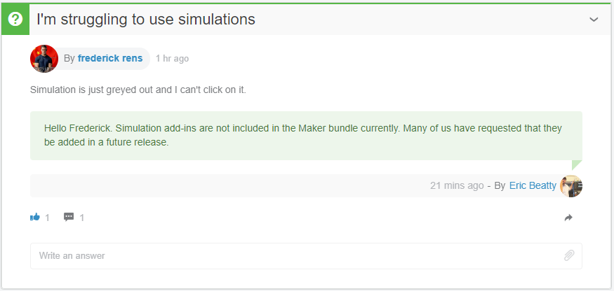

# Solidworks for Makers - Missing manual

<!-- tbd. make a model of a manual book (in SolidWorks), picture here :)
-->

In 2021, Solidworks for Makers was introduced. Instead of multiple thousands of Euros[1] per year, the CAD product is now finally in the reach of hobbyists, at a mere ~120 Eur / year.

This is the **FIRST PROFESSIONAL GRADE CAD PRODUCT** available for hobbyists.

Unfortunately, Solidworks' documentation and support are somewhat flaky, and the author has not found documentation about the *Solidworks for Makers* product offering, on its own. This is where the repo steps in. It's a collection of the things you should know.

Hope it helps you. Let's hop in!

<small>`[1]`: Pricing varies somewhere around 2000..4000 eur. Normally, licenses are bought via distributors, whereas the Solidworks for Makers comes directly. The [How to Buy](https://www.solidworks.com/how-to-buy) page offers categories, but no prices.</small>

>The "Missing manual" is a reference to [this series](https://www.amazon.com/b?ie=UTF8&node=8523805011) (Amazon.com) of books. They were popular in the early 2000's, when people bought Apple products bundled with awesome software but no real guidance on how to use them.

## Focus

The focus of this repo is in the *use* of Solidworks for Makers.

### SW over xStuff

The "xDesign" and "xShape" browser-based offerings are available to Solidworks for Makers customers, and that's all great. This repo ignores those - they are seen as an alternative toolchain.

### Saving to the cloud

With Solidworks for Makers, you can store projects either locally or in the cloud. This repo focuses **solely** on cloud based storage. 

1. It's deemed safer (by the author)
2. It may not be immediately obvious (needs a manual)
3. It provides a platform for team based work (of course we want other people to do our work, right!)

### Buying the license; installing the software

We skip this!

There are some desperate writes by people not able to get the software running, <s>in early</s> *throughout* 2022. This is unfortunate, but we overlook it. It's the responsibility of Dassault to make the experience better. (The author was able to install, in Aug 2022)

## What you get

- Solidworks Professional

   It's able to work on local files, or files in the cloud.

- Solidworks Visualize Connected

   A separate binary, for creating professional level publications of your designs.

- 3DExperience ID

   This is how you log into Solidworks documentation, support forums etc.
   
   >Note: What you have is a "3DExperience ID". It is not a "Solidworks ID"; do not fill that field.

### Restrictions

Files you work on can *only be opened by other Solidworks for Makers* instances, not the "other" Solidworks licenses.

### Hardware and OS requirements

Makers often run on more aged hardware than professional CAD people, so it's good to know what actually works.

||Solidworks recommends|What works|
|---|---|---|
|CPU|"64-bit; Intel or AMD"|Lenovo X230 (2012)|
|RAM|16 GB|12 GB but would recommend 16 GB|
|Graphics|"Certified cards and drivers"|your integrated Intel-based likely works|
|Windows|10 or 11, 64-bit|Windows 10 Home|
|SSD|"recommended"|yes! you want to have SSD
Installation needs some 30GB free (`Program Files/Dassault/**` is 17.3 GB)|

[source](https://www.solidworks.com/support/system-requirements)

>NOTE! The author occasionally suffers from extremely slow sketch performance. This has been described in [TROUBLES](./TROUBLES.md). The reason for this hasn't been fully revealed, yet.

## Glossary

Solidworks for Makers is built on top of company-focused products, and at places this shows as somewhat strange use of terminology. This list is intended to help you browse 3DExperience documentation and forums.

|term|means|
|---|---|
|**platform**|The **account specific** cloud service, i.e. the instance of 3DExperience services that are **under your management**.|
|**tenant**|Used at least [here](https://www.cati.com/blog/3dexperience-platform-administration-adding-users-from-outside-your-organization/) (article, Mar 2021). Likely an alias for "platform" (that Dassault uses). Are these same, or different concepts? *tbd.*|

## Learning resources

The Internet has loads of Solidworks courses, but nothing much that focuses on SolidWorks for Makers, yet. This list is intended to help.

>Note: There's an official help (see [References](#References)), but it's more of a reference book for understanding features tool-by-tool. The author recommends just diving into the tool, and seeing useful videos.

### Learning path

With your "3DExperience ID", you should be able to log into a 3DExperience Dashboard:

This is where learning material for Solidworks for Makers should be.

At the time of writing, there are **only two** learning modules available.

>

>Note the `3DEXPERIENCE R2022x v` drop-down menu on the page. Change it to match your version before viewing.

<!-- hidden; this is better placed in a file of its own; too heavy early on and uncertain, too!
--

We can do better than that!!!

Let's see Dassault's own "MySolidworks" video offerings.

### MySolidWorks videos

This is a training catalog with good contents, but unfortunately its usability sucks. Also, it's not even *supposed* to be available for Solidworks for Makers customers.[2]

<small>`[2]`: This is at least what customer support told the author. It's still strange that the software itself points to here, in its Help.</small>

The access rights to these videos seem to be badly managed - or not at all.

>To get to these without direct links:
>- SolidWorks for Makers > `Ctrl-F2` > `Learn` > `Get Started with SOLIDWORKS CAD` 
>  - ... > (login with `3DExperience ID`) > `Catalog`

The `3DEXPERIENCE (Edu)` link leads to the portal we already covered.

- Double click the `Learning Path` box
   - `Log in` > 

>Hint to Dassault: Couldn't opening this from Solidworks UI already sign the person in, automatically?

Press `Catalog` and you'll be greeted by all kinds of courses:

>Note. As of Aug 2022, the selection is *not aware of Solidworks for Makers* customers. You are allowed to see only the videos meant for "Guest"s.
>
>This is something Solidworks should work upon, providing a meaningful, and comprehensive, subset of the training videos that are available for a *Solidworks for Makers* customer. At the moment, if one picks a training course for "Standard" (which should be relevant for Solidworks for Makers, since it is SolidWorks Professional..), one gets a rather unpleasant dialog asking to "Upgrade". Please fix.

Pick `Guest`. This restricts your choice to 193 videos (as of Sep 2022).

---

>**Weird.** If you select `[x] Professional` and try to see one of those videos, it's not "Professional" (which is covered by Solidworks for Makers) but "Premium" (which is not).
>
>

---

Constrain `Access Level` to `Guest`.

Also click:

- `Version: [x] 2022`, though this leaves many courses out

>The `Product / Role` filter only confuses the author:
>
>
>
>This looks like a **random** collection of products and roles, no consistency.
>
>Maybe these are intentionally "free" (access-wise) training courses throughout the Solidworks offering. But it means you hunting for knowledge for *Solidworks for Makers* is a hit-and-miss.

The author has gone through the 63 (or so) courses. Direct links, lengths and comments are in another file: [MySolidWorks videos](Learning/MySolidWorks%20videos.md)
-->

## Using Solidworks for Makers

Some tips and tricks that the author has learned.

### Updating to latest version

There is no "check for updates" menu, but there are updates.

Within the 3DExperience launcher, if you see this:

>Hint: click the down arrow. Then **ignore** the progress meter . It does not indicate that the software is loading, just that it's fetching some data. (An hourglass icon would do the job better, the author feels..)
>
>In 2-3 seconds, you should see the version information.
>
>Note: At one point, the update information was **only available in the actual entry**, not the favourite link. <!-- REMOVE this comment if in some update you see it in the favourite! tbd. -->

An **orange** arrow means there's an update available.

A **red** arrow means there's a compulsory update.

The software does not prompt you to update. Click the orange/red download arrow and follow the guidance.

An update behaves like a full fledged reinstall. Reserve some time.

### Setting up McMaster-Carr

Fusion 360 relies heavily on McMaster Carr catalog of off-the-shelf parts. SolidWorks integrates PartSupply instead (open assembly, then `Insert from PartSupply`), but its filtering options etc. did not convince the author.

Luckily, you can install McMaster Carr integration also on SolidWorks. 👏

- Instructions: ["How to Integrate SOLIDWORKS with McMaster-Carr Add-In"](https://www.javelin-tech.com/blog/2022/05/how-to-integrate-solidworks-with-mcmaster-carr-add-in/) (article; updated May 2022)

### Saving to the cloud

If you use `Ctrl-S`, **be aware that your files are only saved locally**.

The author recommends `File` > `Save to 3DExperience`:

- `Ctrl-S` saves what is in the memory to the disk. If you have picked `Save to 3DExperience` before, **it still writes to local only**, likely as a cache.

   This is akin to making changes to one's source code, but not committing them.

- Use `Alt-Ctrl-S` when you wish to store a **versioned** copy to the cloud, where others also may have access to it.

This workflow is fine. **It should just be clearly documented.** Now, I can imagine people thinking they are saving to the cloud, when actually... they are just updating the cache.

>👍 Rule of Thumb. If you only want to work in the cloud, never, ever, select a local filename.

>Hint: Use the 3DExperience panel to the right to manage your loads, revisions and saves. It's always cloud based.

## Separate sections

Some areas need more words, and pictures, to explain. That's why they are placed in their own README's:

### [Collaboration](Collab/README.md)

   The whole point of Dassault's cloud based "3DExperience" is working with teams. There are tools like [3DSwym](...) and [Enovia](https://discover.3ds.com/product-lifecycle-management-cloud-enovia-dassault-systemes) that Dassault uses for this.

<!-- Editor's note:
   Further material (sections) would be placed here.
-->

## Selected questions

Picked from [2]:

- [Changing of GUI language](https://r1132100503382-eu1-3dswym.3dexperience.3ds.com/#community:kKnaKWHGTPC4ut-q1X_9uA/iquestion:o4fpC_KOSKWKb3q-aNRosg) (15-Sep-2022)

   

Changing the language

   >How can I change the language of the GUI in Solidworks connected? The software displays its menus in German but I would like to see them in English.
   

   
- **Asking for simulation**

    (14-Sep-2022)

    (19-Sep-2022)

## Resources

### Discussion Forums

- [MAKERS | Support community](https://r1132100503382-eu1-3dswym.3dexperience.3ds.com/#community:kKnaKWHGTPC4ut-q1X_9uA) [2]

  - mentioned [here](https://www.3ds.com/online-store/faq) (3DS Online store FAQ) > `Support` > `How can I get..`

- [Solidworks User Forum](https://r1132100503382-eu1-3dswym.3dexperience.3ds.com/#community:yUw32GbYTEqKdgY7-jbZPg)

   Perhaps once I know which questions to ask / what to look for.

   Jewels:

   - [Answer by Eric Beatty](https://r1132100503382-eu1-3dswym.3dexperience.3ds.com/#community:kKnaKWHGTPC4ut-q1X_9uA/iquestion:b6FW5YRQSeqVCVEDoi65KA) (May 2022) lists SW training material he recommends.

>The Solidworks Forums' UI is messy - not a fan of three panels sidewise (it was a UI trend in late 1990's)... Either there just IS so much content, or the tool makes it look cluttered.

>Note: The "3DSwym" in the title is Dassault's community building product.

### Learning

- `introsw.pdf` on your local disk (paste to browser: `file:///C:/Program%20Files/Dassault%20Systemes/SOLIDWORKS%203DEXPERIENCE/SOLIDWORKS/lang/english/introsw.pdf` )

   A very nice, linearly readable tour of basic CAD features (Parts, Assemblies, Drawings). Recommendable to newcomers to CAD, and for people coming from other CAD systems, to see how things are done - and what they are called - in Solidworks.

   >As mentioned [here](https://r1132100503382-eu1-3dswym.3dexperience.3ds.com/#community:kKnaKWHGTPC4ut-q1X_9uA/wiki:QQf93gZSTvu30bSBKC04Qw) (by Jennifer Tashiro, 3DSwym MAKERS Support) 

- [How to Create Your First Model in SOLIDWORKS Connected](https://r1132100503382-eu1-3dswym.3dexperience.3ds.com/#community:kKnaKWHGTPC4ut-q1X_9uA/wiki:7q-yfe3BRLeTMCJnnj4wGQ) (Dassault wiki)

   "Solidworks Connected" was the earlier branding for "Solidworks for Makers" (or at least, they are somehow the same..)
   
- [Solidworks Connected Help](https://help.solidworks.com/2022/english/SWConnected/swdotworks/c_fundamentals.htm) (Solidworks docs)

   This looks dry.

- [3DExperience Tutorials](https://www.youtube.com/c/3DExperienceTutorials) (Youtube channel)

### Announcements, blogs

- ["‘Make It Real’ Today with This Special Offer for Makers & Hobbyists!"](https://blogs.solidworks.com/solidworksblog/2021/08/make-it-real-today-with-this-special-offer-for-makers-hobbyists.html) (blog, Aug 2021)

### CAD Models

It's really nice to be able to download full CAD models and learn from them.

- MySolidWorks > [CAD Models](https://my.solidworks.com/cadmodels)

<!-- tbd. add comments about each site
-->
