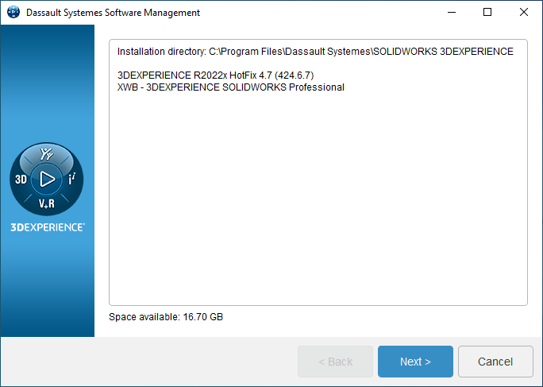

# Tidbits (unrelated pieces of information)

## How to check my SolidWorks for Makers Hotfix level locally

There's a Dassault management software, alongside the local SolidWorks for Makers.

Windows Search > `Software Management` > (3DExperience icon) > `List installed components`

