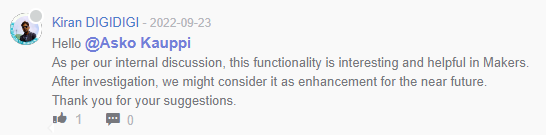

# Track

## No access to Standard training material

- 3DSwym MAKERS | Support > ["Did I buy the wrong subscription?"](https://r1132100503382-eu1-3dswym.3dexperience.3ds.com/#community:kKnaKWHGTPC4ut-q1X_9uA/iquestion:94qYkagdSeKptK0AsDmuwg) (by Mark Ellsworth, Jul 2022)

- [ ] [tweet on 10-Aug-22](https://twitter.com/shotduck7/status/1557346584475615232?s=20&t=QVq-cItwCGn3lkpqiQrBzQ)

## How to share?

>
>
>Appreciated, but keep looking whether anything actually changes..

- [ ] ["How to share designs when audience isn't yet known?"](https://r1132100503382-eu1-3dswym.3dexperience.3ds.com/#community:kKnaKWHGTPC4ut-q1X_9uA/iquestion:ueNeAjBZQA6qu8e_ZOAkkQ)

   This is the BREAKING request-for-help. Do I get any??????
   
   "Kiran Digidigi" suggested [here](https://r1132100503382-eu1-3dswym.3dexperience.3ds.com/#community:kKnaKWHGTPC4ut-q1X_9uA/iquestion:Pib1ulBGT3OdCgybnyUFoQ) a wiki page [here](https://r1132100503382-eu1-3dswym.3dexperience.3ds.com/#community:kKnaKWHGTPC4ut-q1X_9uA/wiki:q6h84l9NQbC4VwNIVFNNWg) that leads to [here](https://r1132100503382-eu1-3dswym.3dexperience.3ds.com/#community:4/post:rHFgrLlQRr6w7xEwrVCYlA).
   
   - That page is from Feb 2019, preceding launch of Solidworks for Makers **by two years**. I don't think it's relevant.
   
     Also, having read that page I understand 0% of it...
     

