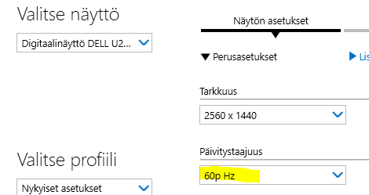

# Troubleshooting

## *Extremely* slow SolidWorks UI behaviour

The author experiences this, from time to time on the following hardware:

|||
|---|---|
|*Lenovo X230 ThinkPad*|
|&nbsp;&nbsp;CPU|Intel(R) Core(TM) i7-3520M CPU @ 2.90GHz|
|&nbsp;&nbsp;memory|12 GB|
|&nbsp;&nbsp;OS|Windows 10 Home; 64 bit|

>Such a device is not on SolidWorks recommended list, far from it! But when things are smooth, it's a perfectly usable system for maker CAD design (Oct 2022). Thus, this write to make the "cough" go away!!!

<!--
Latest seen on: 
Windows 10 22H2 build 19045.2251
-->

**Symptoms**

SolidWorks Connected launches, but behaviour within its user interface is sluggish: hovers above points are not reacted (until 10's of seconds), sketching simple things on a new project (lines, circles) is hopeless (but happens eventually).

During this time, CPU load is around zero. The slowdown is not CPU based.

Evidence

- [Sketching is normal](https://drive.google.com/file/d/1EGnWh-ZMSzSApW5h7eSg32HAkQOhGH1x/view) (video, 30s, Google Drive)
- [Sketching is sluggish](https://drive.google.com/file/d/1WpwyxYfHqUSiLQurXI-g7JA5tuX8tuIm/view) (video, 26s, Google Drive)

**Remedy**

- Disconnect external display cable. Work on the laptop's own display.

   This helped instantly on one occasion (7-Oct-22). No need to even restart SolidWorks.

   >15-Nov-22. Second occasion. Helped.

Obviously, one wants to work on the larger screen, though.

<!-- likely not relevant
- Visit Intel HD Graphics settings

   
   
   The refresh rate was 59p for some reason. Changing it to 60p took the slow-down away (and one can continue using external monitor).
   
   Try this.
-->

 - **Re-install** Solidworks for Makers

   - Control Panel > `Add or Remove Applications`
      - Uninstall `Dassault Systemes SOLIDWORKS 3DEXPERIENCE R2022x`

   - Restart

   - Re-launch the application from the 3DExperience taskbar icon

      This will re-install the whole program, with latest Hotfix.

   For the author, this seems to have fixed the sluggish sketch problem. **knock wood**

## Cloud files not shown by R2023x

This... is a sad one.

**Expectation**

If the cloud-based product launches, I have access to my cloud (3DExperience) data. From the first millisecond. Otherwise, it's not launched.

**Actual**

Until the product flashes a "Connected" banner , the program doesn't know there's cloud. This may take **30 seconds** after the UI is otherwise up!!!

The problem is, during this time the UI allows going to `File` > `Open` and seeing the `Open from 3DExperience` button dimmed!

**Suggestion**

Please either (preferred!) make the detection of the cloud id faster (such shouldn't take more than ~100ms in the API layer, right??) or **delay the enabling of the UI** until cloud status is known.

The current situation is confusing.

|||
|---|---
|Launched the product|0 s|
|Seeing the loading banner|8 s|
|UI actionable (*seeming* start time)|35 s|
|"Connected" banner seen (*real* start time!)|61 s|

*Timings on a Lenovo Thinkpad X230 (it's old!), 100Mbps Internet connection. Physical location: Finland.*
