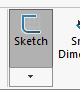
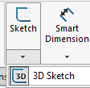

# Closing a 3D sketch

The UI is a bit misleading here.

1. Create a 3D sketch.

   Draw stuff. Now you want to close it.

   

   >Pressing this highlighted icon does *not* end the sketch.

2. Click the Sketch menu open, and the 3D Sketch icon under there.

   

There's no good guidance as to why a 3D sketch should be closed this way (the author happened to figure it out, trying to think how the software would "think").

## Possible corrections to make this go away

- [ ] Allow a 3D sketch to be closed the same way as a normal sketch (i.e. clicking on the highlighted `Sketch` would have done it)

or:

- [ ] *Not* highlighting the `Sketch` (which is misleading), but the `3D Sketch` within the menu. Then, clicking it would close the sketch (as it already does, but since it's not currently highlighted it's misleading).

