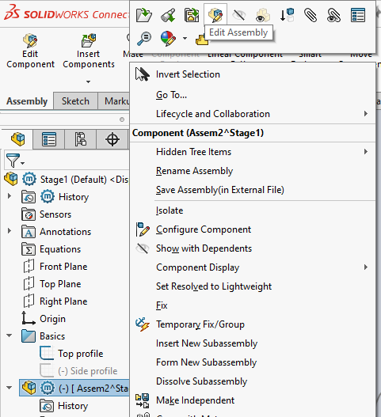
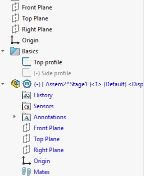

## Editing a subassembly

There are two ways to do this:

- `Isolate`. 

   Opens the subassembly as its own window. Use to do focused work that doesn't reach outside of the wider world.

- (right click) > `Edit Assembly` (from the icons)

   

   This turns your assembly-under-edit into blue (see below) and *does* allow you to reference the outside world.

   

   Use it to e.g. steer things within subassemblies, from a base sketch, in the top assembly.

   