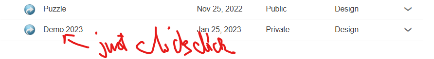
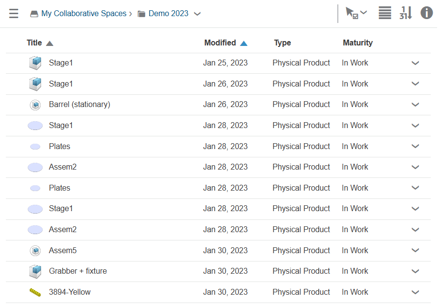

# Open material in 3DSpace

For the longest of time (some 6 months!) this author thought 3DSpace is only for *administering* access to material - not actually seeing it. This felt a bit weird, but... not impossible, at this stage.

## Just Double Click (remember from the 90's?)

It's unusual for browser applications to behave differently on single and double click. Well, meet 3DSpace.

Single clicking that line adds a selection tick to it.

Double clicking opens the contents of the said collaboration space!

Now that I know it... but think - there's **absolutely no visual clue** on the 3DSpace UI that double clicking would work. Heck - the "demo 2023" isn't even a link (which, by traditional web page UX would be underlined and take a *single* click to open).

>WARNING!
>
>Don't get comfortable with this! There is a thing called Internet and in it, traffic rules are that double click is banned. It's strenous on the hand, but more importantly **it's just NOT IN THE VOCABULARY OF THINGS TO DO**. 
>
>3DExperience is NOT 3D. It's a nostalgic attempt to recreate the worst parts of ca. 1990's desktop environments, in a cloud context. It itself should be banned!!!

Above is not an opinion. While some UX issues are, others are more like facts - or traffic rules. They are the *foundation* of what makes web great. Applications work the same way. Less need to learn the quirks of a certain one.

Except. 3DSpace.

RIP