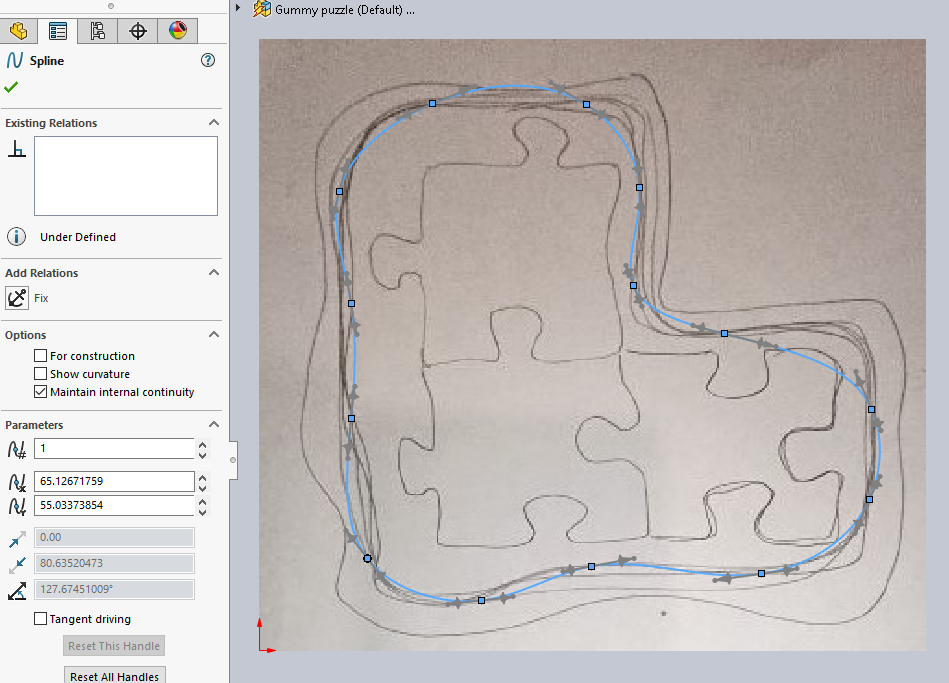
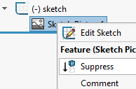

# Sketching over an image

>Source: ["How to insert a picture in SOLIDWORKS"](https://grabcad.com/tutorials/how-to-insert-a-picture-in-solidworks) ()

It's often useful to have a backdrop for a sketch.

Here's how: 

- Create a sketch
   - `Tools` > `Sketch Tools` > `Sketch Picture...`

Select the picture and sketch on top of it.

Once you've used the graphic as a backdrop, you can suppress it out of the way:

