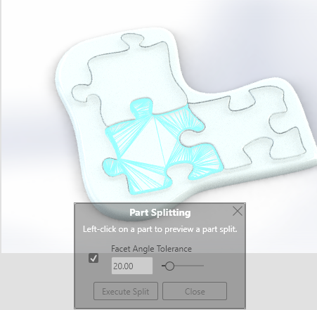
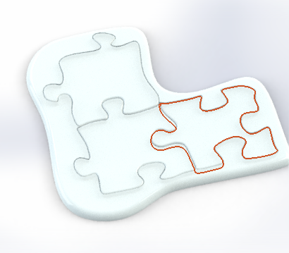

# Part split

If you have a multi-body part, Visualize treats it as one thing.

To assign different appearances to different bodies, run `Tools` > `Split part...`:

Here, the rim and the three puzzle pieces are separate bodies within the same Solidworks part.

One of them has been selected for splitting.

Visualize no longer treats the part as one - each split (subpart? ;) can get its own appearance.

