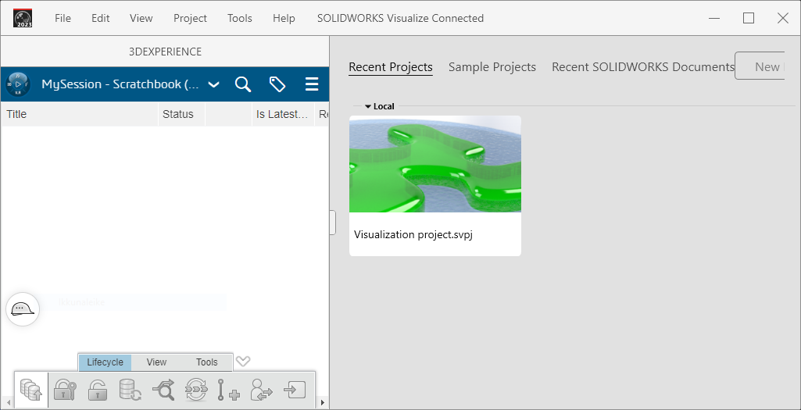
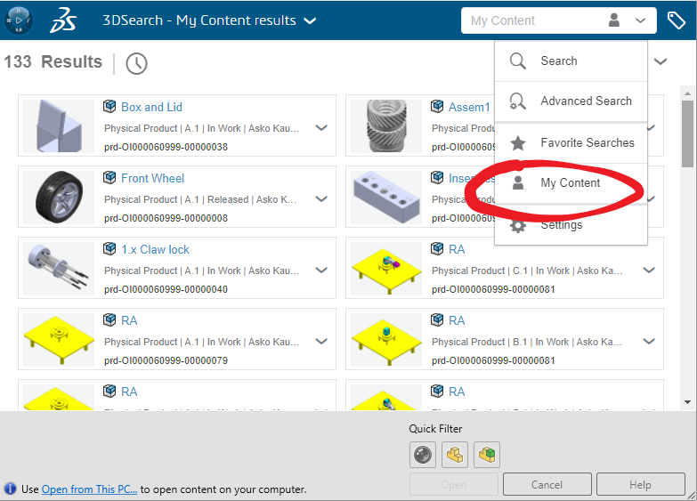
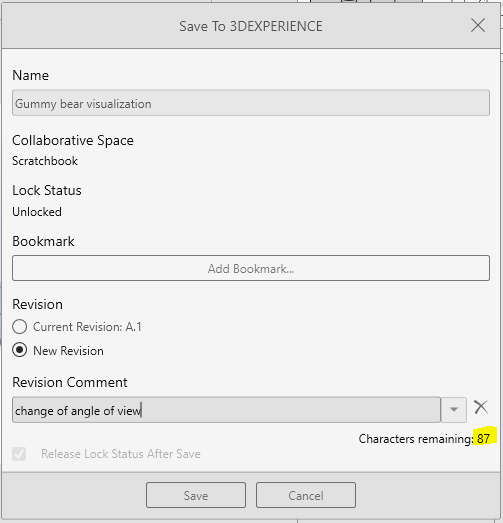
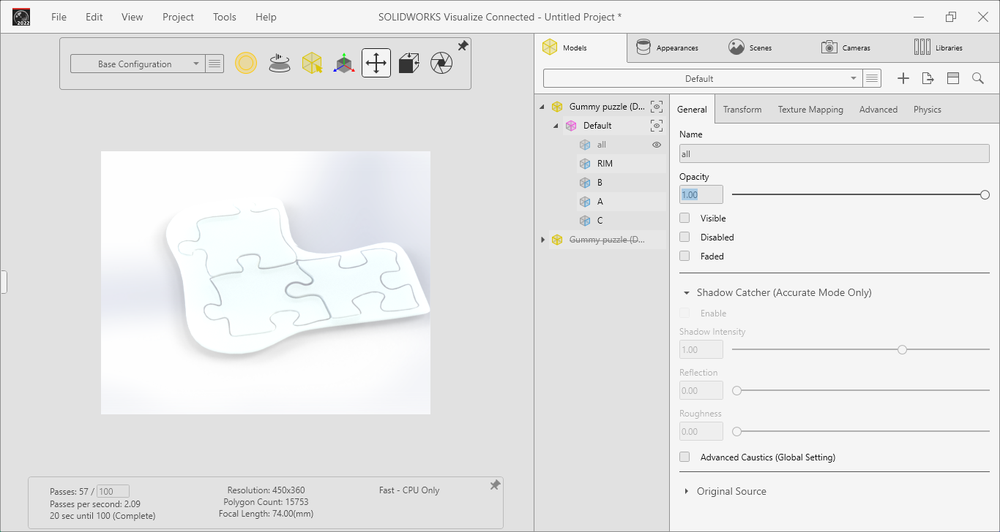

# Solidworks Visualize Connected

Solidworks for Makers includes Solidworks Visualize Connected. This is a separate Windows native program for creating ray-traced presentation material.

You can open Solidworks projects in Visualize, then beef the appearances etc. more than in Solidworks itself, with:

- transparent appearances
- ray-traced presentation stills

<!--
*tbd. Make a full list of things not possible in Solidworks, but possible in SW Visualize.*

tbd. A diagram showing how 3DExperience projects fit to Visualize projects.  Ssomething like:

    3DExperience model  --\>  Visualize project
-->

Before reading further, consider seeing this [marketing video](https://www.solidworks.com/media/3dexperience-solidworks-visualize-connected-biodapt) (5:49) that nicely lays out the tool and possible workflows.

## Installation

The sofware gets installed alongside Solidworks for Makers.

## Launching

3DExperience "compass" launcher > `Visualize`

>Hint: You can create a local shortcut, as for Solidworks itself.

---

## INITIAL PROBLEM - Where are my PROJECTS???

I have a Solidworks project stored in 3DExperience (= cloud). Would like to visualize it. Easy, right??

Launching Visualize I manage to see this:

>

*Ignore the gooey project; it's from earlier tries*

Pane to the left seems to indicate I'm connected; but there is no data!

### Solution 1

By trial and error...

- `Open Project`

  - `My Content`

  

---

## Visualize project

Once you have opened the 3DExperience project (the model), you have an "untitled" project in Visualize.

>

By using `File` > `Save with options`, one can save to 3DExperience (cloud), with revisions.

>

>Note: It is a bit unclear, what is the relationship of a Visual project vs. a Solidworks model. This is *exactly* why this repo exists. Contributions welcome!!

## Workflow

You'd now go on to change appearances, and get something far more realistic than this:

## Tips: Layout

If working on a small screen (laptop), try stretching the panes. The author enjoys this setup:

## Training material

- ["SolidWorks Visualize 2020 Introduction"](https://www.youtube.com/watch?v=OwIIEloXfeg) (Youtube, Mar 2021, 10:50)

## References

- [Solidworks Visualize Help](https://help.solidworks.com/2023/English/Visualize/HelpViewerDS.aspx?version=2023&prod=Visualize) (Solidworks Visualize docs; 2023)

   - ["Installing SOLIDWORKS Visualize Connected"](https://help.solidworks.com/2023/English/Visualize/t_visualize_3DX_install_visualize_connected.htm)

- ["Render Them Speechless with SOLIDWORKS Visualize Connected | Exploring 3DEXPERIENCE Works"](https://youtu.be/24ni9RsRmNM?t=211) (Youtube, Jan 2021, 40:02)

   >Link starts at 3:32 (the beef)
