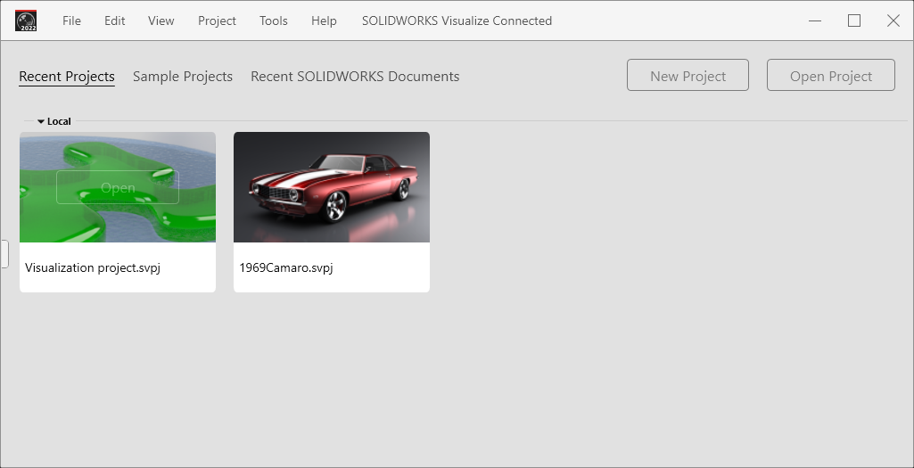

# Solidworks Visualize Connected

Solidworks for Makers includes Solidworks Visualize. This is a separate binary (Windows program) for creating ray-traced presentation material.

You can open Solidworks projects in Visualize, then beef the appearances etc. more than in Solidworks itself.

E.g. transparent appearances, ray-traced presentation stills.

<!--
*tbd. Make a full list of things not possible in Solidworks, but possible in SW Visualize.*
-->

## Installation

The sofware gets installed alongside Solidworks for Makers.

## Launching

3DExperience "compass" launcher > `Visualize`

>Hint: You can create a local shortcut, as for Solidworks proper.

## PROBLEM 1 - Where are my PROJECTS???

I have a Solidworks project stored in 3DExperience (= cloud). Would like to visualize it. Easy, right??

Launching Visualize I manage to see this:

>

*Ignore the gooey project to the left; it's from a local harddisk*

Take `Recent SOLIDWORKS Documents` 

>Note: There's only `Local` grouping here, but these seem like something I've worked on, **in the cloud**.
>
>Likely they are the locally cached copies of what's in 3DExperience

---

>**TO DASSAULT:**
>
>This is not great. You are touting about the 3DExperience everwhere you can, yet when one opens one of the tools, it's **completely unaware of the thing**. What's cooking??

---

## Layout

If working on a small screen (laptop), try stretching the panes. The author enjoys this setup:

