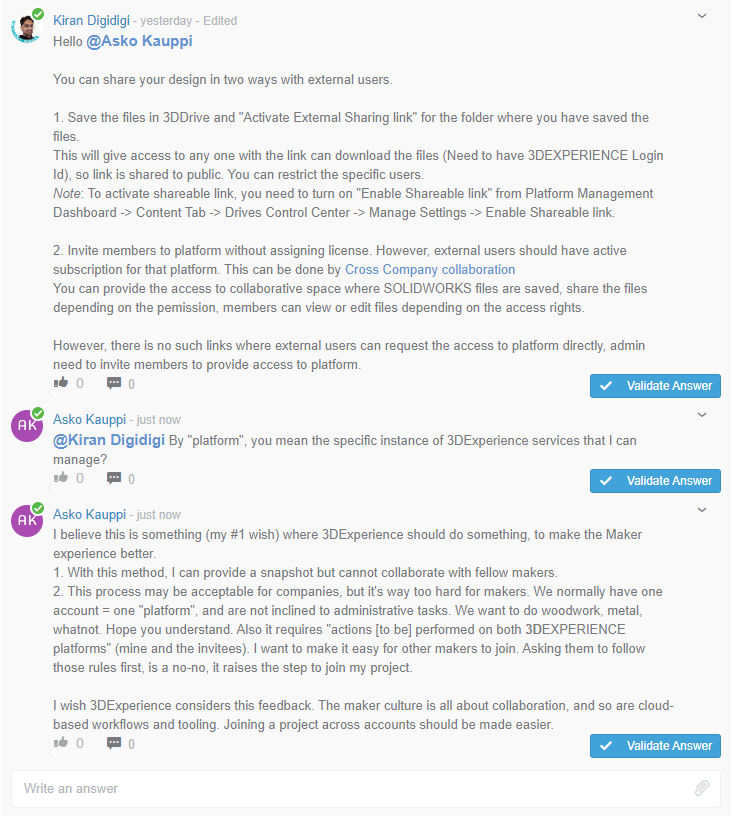

# Wishes to Solidworks

## Easier to invite/join a project

I asked about this [here](https://r1132100503382-eu1-3dswym.3dexperience.3ds.com/#community:kKnaKWHGTPC4ut-q1X_9uA/iquestion:ueNeAjBZQA6qu8e_ZOAkkQ).

The answer points to [this wiki page](https://r1132100503382-eu1-3dswym.3dexperience.3ds.com/#community:4/post:rHFgrLlQRr6w7xEwrVCYlA) (edited Feb 2019)

>Note: Solidworks for Makers was released **two years** after the writing of that wiki page.

Compare the model with that of Fusion 360. e.g. [here](https://knowledge.productdesignonline.com/article/33-can-you-share-a-fusion-360-project-with-others#:~:text=Solution%3A%201%201%20Open%20a%20Project%20in%20the,addresses%20of%20everyone%20you%27d%20like%20to%20invite.%20) (third party article, updated Feb 2021)

The difference is that:

- In Fusion 360, all registered Fusion 360 users are available to be sent invites
- In 3DExperience, only the members of the "platform" (the one company?) are listed

The collaboration model, and the needs for privacy protection are different in the Maker world than in the corporate world.

Maker organizations would normally have just 1..few users, making them individual islands.

### Suggestion for fixing this...

For Solidworks for Makers product customers, allow sending invites **to any other Solidworks for Makers** user, by their user handle.

This would be the same model as being used in Fusion 360, and I've heard no friction about it from there.

The solution should:

- be simple for the invitee to follow (just accept the invite)
- be simple for the project owner (no need to do administrative dances)

## Am I guest??

With the Solidworks Makers license, which learning material am I entitled to?

The "MySolidWorks Account" page[1] does not have anything Maker specific.

Under `Training` > `Catalog`:

<small>`[1]`: https://my.solidworks.com > `Log In` > `Log in with 3DEXPERIENCE ID`</small>

**Expected**

As a paying customer (Solidworks for Makers), I can:

- log into MySolidWorks with my 3DExperience ID
- and see learning videos appropriate to the product

**Actual**

- I see some material, others being blocked:

   

- It does not seem logical where the limit between allowed and blocked material is (some of it is basic, like "Editing Sketches").

## Focused Twitter or Chat support for SolidWorks for Makers

Solidworks for Makers is in its infancy. There are issues that arise because of this - and Makers would prefer a speedy channel like Twitter to get fast responses. (A chat will also do..)

The current official stage (listed [here](https://www.solidworks.com/solution/company-type/makers)), https://r1132100503382-eu1-3dswym.3dexperience.3ds.com/#community:kKnaKWHGTPC4ut-q1X_9uA is a sad place to visit.

- Most comments are about installation problems, or wanting their money back

This laundry makes me feel I don't want to raise my problem here.

## No need for multiple instances of SolidWorks for Makers

Currently (Nov 2022), one can launch Solidworks for Makers multiple times. 

### Why this may be a problem

There is no benefit in being able to run multiple instances, in tandem. It's just a distraction.

On slower machines, this can happen unintended, since there's a multiple seconds delay between launching the software and seeing the loading graphics.

### Existing

One can launch multiple SolidWorks for Makers instances.

### Suggested

The software would recognize an already running instance (or claim such lock) and bring that process in the front.

## [Online] Proper support forum

The existing Swym tool is not nearly sufficient to be used as a support tool. It doesn't seem to be meant for that, either!

Features the author misses:

- Ability to collect related issues (reports) together.

   Not having this causes a never-ending "I cannot install" set of messages, many of which are incidents of the same underlying cause.

- Ability to **link to an incident** and **watch changes to it**

   These are trivial, in a system such as GitHub Issues, and many others. We want to be notified when relevant info shows up, **not polling for updates manually!**

- Abilitity to **tag** issues

- Ability to **vote up** - also comments

   Ability to vote up comments allows a **community** to arise, which helps each other. Current state is that one can like the original message (it's a messaging platform, NOT a ticketing platform!), but not any later contributions.

There's NO VALUE in not bringing a ticketing solution to Solidwork for Makers.

This is NOT A CRITICISM to the Swym platform. It's just being used wrong, and it doesn't stretch to the expectations (and valid needs) of customers. 

DO NOT EXTEND the platform. That's unnecessary, since loads of good ticketing platforms already exist.

>*Whisper:* The Solidworks for Makers business model is different from what Dassault is used to. It's a direct business-to-consumer model instead of the one going through resellers. Perhaps this is behind the lack of a well functioning support forum (measured by the lifetime of tickets; and issues actually getting resolved). It's not an excuse to not do anything about the problem!!!

