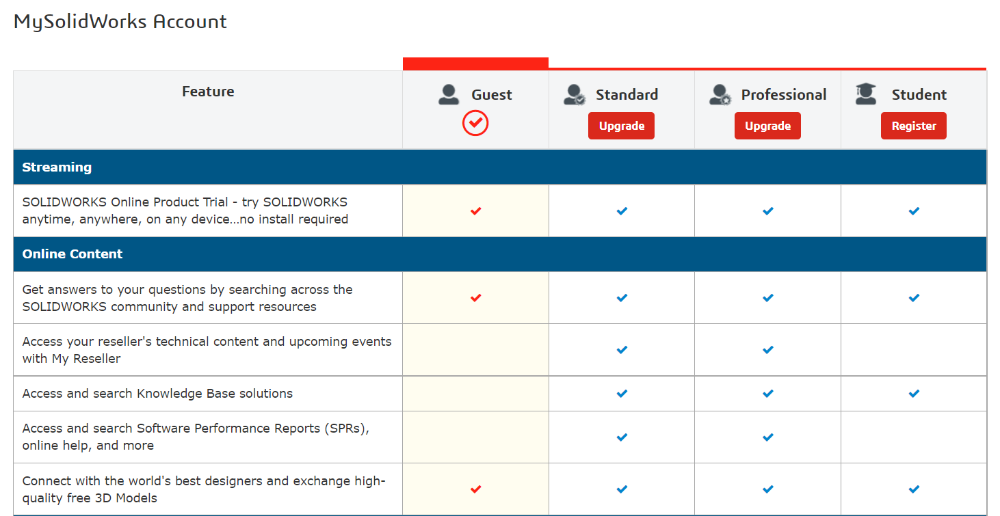
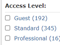
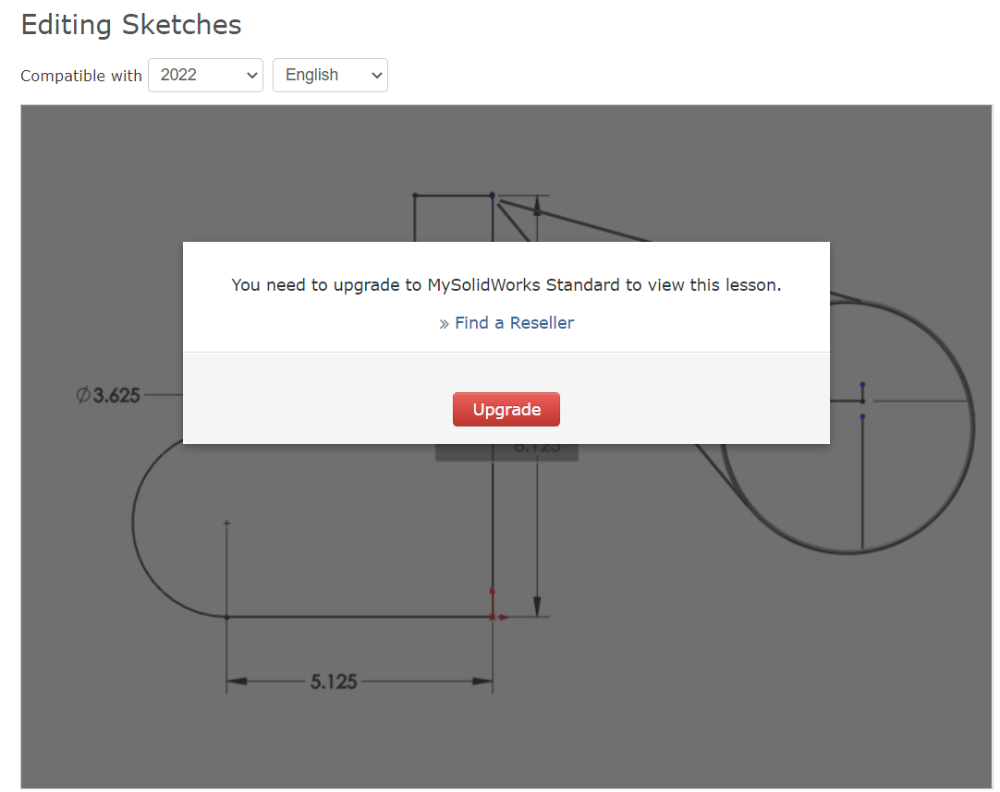

# Wishes to Solidworks

## Am I guest??

With the Solidworks Makers license, which learning material am I entitled to?

The "MySolidWorks Account" page[1] does not have anything Maker specific.

Under `Training` > `Catalog`:

<small>`[1]`: https://my.solidworks.com > `Log In` > `Log in with 3DEXPERIENCE ID`</small>

**Expected**

As a paying customer (Solidworks for Makers), I can:

- log into MySolidWorks with my 3DExperience ID
- and see learning videos appropriate to the product

**Actual**

- I see some material, others being blocked:

   

- It does not seem logical where the limit between allowed and blocked material is (some of it is basic, like "Editing Sketches").

## Focused Twitter or Chat support for SolidWorks for Makers

Solidworks for Makers is in its infancy. There are issues that arise because of this - and Makers would prefer a speedy channel like Twitter to get fast responses. (A chat will also do..)

The current official stage (listed [here](https://www.solidworks.com/solution/company-type/makers)), https://r1132100503382-eu1-3dswym.3dexperience.3ds.com/#community:kKnaKWHGTPC4ut-q1X_9uA is a sad place to visit.

- Most comments are about installation problems, or wanting their money back

This laundry makes me feel I don't want to raise my problem here.
